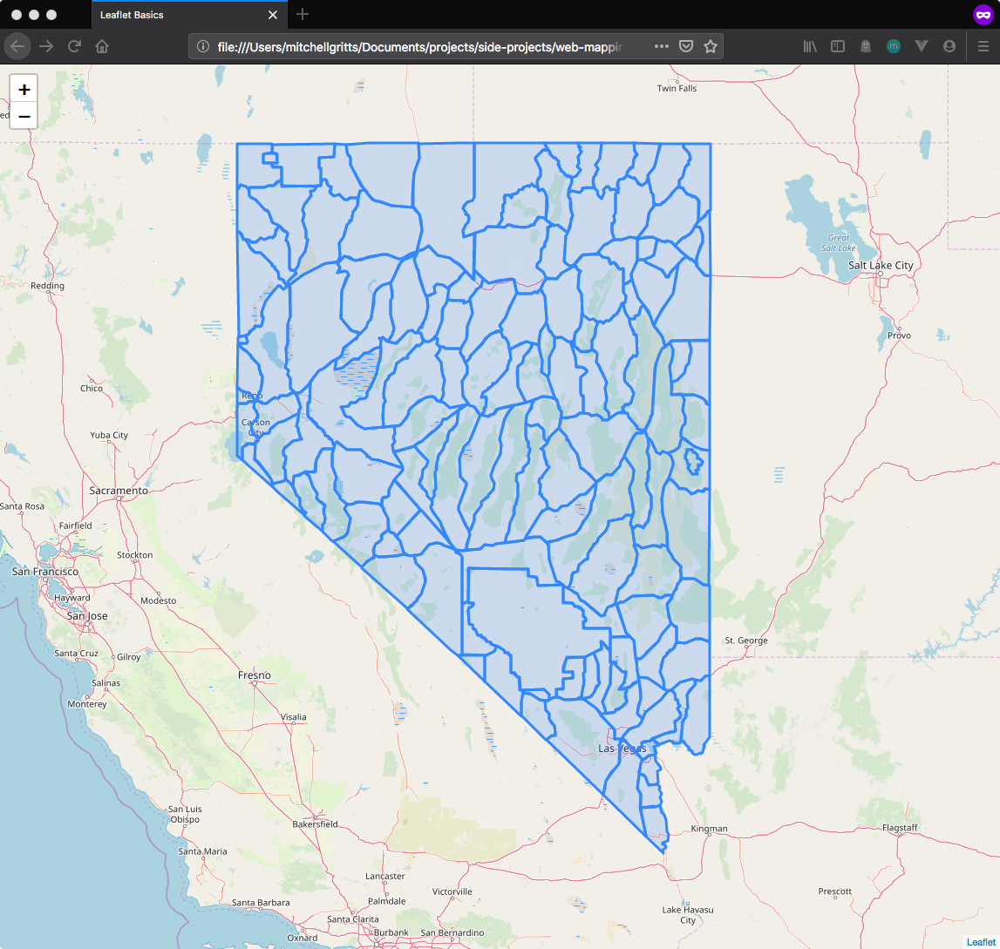
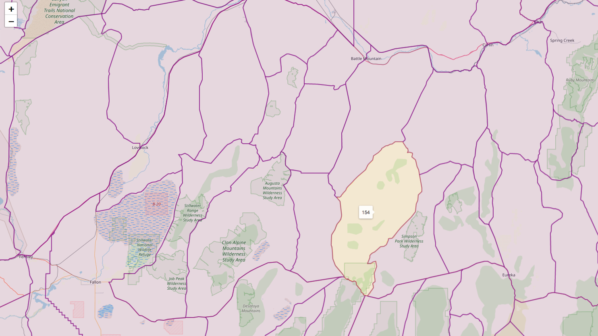

I've been struggling with how I should serve vector data (points, lines, polygons) from some kind of data store, then render them on the web. There seem to be many different methods to serve them. Then there are equally many methods to render them on the web. 

I've read a lot about web feature services, web tile service, Mapbox vector tiles, etc. These all seem great, but I don't really understand how they work. Part of me really hates not fully understanding the technologies I'm using. So I decided to start at the beginning. Well, I guess the beginning in my mind. The easiest approach, IMHO, would be to create a file server that sends the contents of GeoJSON files to the client. 

In this post I'll review this method, and hopefully set the ground work for future work on all the other methods that are out there. 

## Maps on the web

Check out my previous post to learn about the basics of Leaflet. It also covers how to create a simple HTTP file server to server HTML pages and data.

## Data

We'll need some polygons to render on this map. The data can be downloaded from the GitHub repo ([here](https://github.com/kissmygritts/web-mapping/blob/master/data/nv-hunt-units.geojson)). These polygons are for the hunt units in Nevada. They are already projected in EPGS:4326, which is suitable for web mapping. 

## Render polygons on the map

To render the polygons on a map create an folder called `leaflet-geojson`, then a file within this folder called `index.html`. On the command line, use these commands

```bash
> mkdir leaflet-geojson
> touch leaflet-geojson/index.html
```

Then, reproduce the contents of the code block below in your `index.html` file.

```html
<!DOCTYPE html>
<html lang="en">
<head>
  <meta charset="UTF-8">
  <meta name="viewport" content="width=device-width, initial-scale=1.0">
  <title>Leaflet Basics</title>
  <link rel="stylesheet" href="https://unpkg.com/leaflet@1.5.1/dist/leaflet.css"
    integrity="sha512-xwE/Az9zrjBIphAcBb3F6JVqxf46+CDLwfLMHloNu6KEQCAWi6HcDUbeOfBIptF7tcCzusKFjFw2yuvEpDL9wQ=="
    crossorigin="" />
  <script src="https://unpkg.com/leaflet@1.5.1/dist/leaflet.js"
    integrity="sha512-GffPMF3RvMeYyc1LWMHtK8EbPv0iNZ8/oTtHPx9/cc2ILxQ+u905qIwdpULaqDkyBKgOaB57QTMg7ztg8Jm2Og=="
    crossorigin=""></script>
  <style>
    html, body {
      height: 100%;
      margin: 0;
    }
    .map-container {
      height: 100vh;
    }
  </style>
</head>
<body>
  <div id="mapid" class="map-container"></div>
</body>

<script>
  const leafletMap = L.map('mapid').setView([39.55, -117.0667], 7)

  L.tileLayer('https://{s}.tile.openstreetmap.org/{z}/{x}/{y}.png', {
    maxZoon: 18,
  }).addTo(leafletMap)

  // make http request to load nv-hunt-units data
  fetch('http://localhost:9000/data/nv-hunt-units.geojson')
    .then(res => res.json())
    .then(jsonRes => {
      L.geoJson(jsonRes, {
        style: {
          'color': 'purple',
          'weight': 2,
          'opacity': .5,
          'fillOpacity': .1

        }
      })
    })
</script>
</html>
```

This is a bit different from the last post. Let's walk through it a bit.

1. HTMLis the same, so is the `style` section
2. Initializing the map is the same. I'm using OpenStreetMaps baselayer and `setView()` is the same
3. I used the JavaScript `fetch` API to make an HTTP request to our HTTP file server
  * `fetch` uses promises instead of callbacks. So after the HTTP request is made, we wait for the data to be received, `then` get the JSON response
  * `then` (again) we use the JSON response, which is a properly formatted GeoJSON, to render the hunt units with `L.geoJson`. 
4. I also added some styling for the hunt units.

The GeoJSON methods for leaflet parse GeoJSON data and display it on a map. There are several method and options for GeoJSON objects, see the [full documentation for more details](https://leafletjs.com/reference-1.5.0.html#geojson). 

Save the file and make sure your http server is running (start it with `python -m SimpleHTTPServer 9000`), then Navigate to `http://localhost:9000/leaflet-geojson`. Since we named our HTML file `index.html` the file server know to render that page. The map and the polygons should render, and look like the image below. Moving forward, anytime we make changes to the `index.html` file refresh you browser to see the changes.



### Basic interactivity

We can add some basic interactivity to the polygons on the map by defining a popup or tooltip to render when clicked or hovered. Replace the `script` tag with the following code. In order to do this, we will use the `L.geoJson.onEachFeature` property to add a function that is usefull fo binding events and popups to features of each feature in the GeoJSON.

```html
<script>
  const leafletMap = L.map('mapid').setView([39.55, -117.0667], 7)

  L.tileLayer('https://{s}.tile.openstreetmap.org/{z}/{x}/{y}.png', {
    maxZoon: 18,
  }).addTo(leafletMap)

  fetch('http://localhost:9000/data/nv-hunt-units.geojson')
    .then(res => res.json())
    .then(jsonRes => {
      L.geoJson(jsonRes, {
        style: {
          'color': 'purple',
          'weight': 2,
          'opacity': .5,
          'fillOpacity': .1

        },

        // L.geoJson.onEachFeature is a function that will be called once for each
        // created feature. Usefull for attaching events and popups to features 
        onEachFeature: (feature, layer) => {
          if (feature.properties && feature.properties.name) {
            layer.bindTooltip(feature.properties.name)
          }
        }
      })
        .addTo(leafletMap)
    })
</script>
```

The procedure is very similar for adding popus when a feature is clicked. Instead of using `L.bindTooltip` use `L.bindPopup`.

### Hover events

I've seen some cool hover interactions on maps. If you want to add something like that to leaflet we will use the `mouseover` and `mouseout` events in the `onEachFeature` property of the GeoJson. Shout out to (this StackOverlow answer)[https://stackoverflow.com/questions/27748453/mouseover-actions-with-geojson-polygon] for the code!

```html
<script>
  const leafletMap = L.map('mapid').setView([39.55, -117.0667], 7)

  L.tileLayer('https://{s}.tile.openstreetmap.org/{z}/{x}/{y}.png', {
    maxZoon: 18,
  }).addTo(leafletMap)

  fetch('http://localhost:9000/data/nv-hunt-units.geojson')
    .then(res => res.json())
    .then(jsonRes => {
      L.geoJson(jsonRes, {
        style: {
          'color': 'purple',
          'weight': 2,
          'opacity': .5,
          'fillOpacity': .1

        },

        // L.geoJson.onEachFeature is a function that will be called once for each
        // created feature. Usefull for attaching events and popups to features 
        onEachFeature: (feature, layer) => {
          if (feature.properties && feature.properties.name) {
            layer.bindTooltip(feature.properties.name)
          }
          
          // adding hover styles to GeoJSON elements with the mouseover
          // mouseover adds the new style to the feature
          layer.on('mouseover', function () {
            this.setStyle({
              'color': 'orange'
            })
          })

          // and mouseout removes the style from the feature
          layer.on('mouseout', function () {
            this.setStyle({
              'color': 'purple'
            })
          })
        }
      })
        .addTo(leafletMap)
    })
</script>
```

There are countless ways to add interactivity to a Leaflet map. For more details check the [`Evented`](https://leafletjs.com/reference-1.5.0.html#evented) and [event objects](https://leafletjs.com/reference-1.5.0.html#event-objects) portions of the Leaflet documentation. Hopefully, your map will look like this:



## Wrap up

This was a simple experiment, on my part, to get GeoJSON polygons on a map, style those polygons, and add some basic interactivity. Moving forward I want to work on adding several features to this experiment. 

1. Interactively filter features in a GeoJSON. The data used here have a single property. They aren't very good for filtering.
2. These polygons aren't going to change anytime soon. Maybe I can serve these as prerendere vector tiles, etc. to increase performance.
  * This will be important as the size of the GeoJSON increases. 
3. Have multiple GeoJSON features overlap.

All of this in future posts!

## Updates

### 2019-0702

I've worked on getting this example working in [Mapbox GL JS](mapbox.com). The Mapbox library has a lot of interesting use cases, however I found it pretty difficult to work with. The performance also seemed very slow. But, that is probably my computer (8 year old MacBook Pro). Anyway you can find the mapbox folder in the Repo. I've removed my `mapbox.accessToken`. You'll need to add your own, or you will get an error when attempting to render a map. 