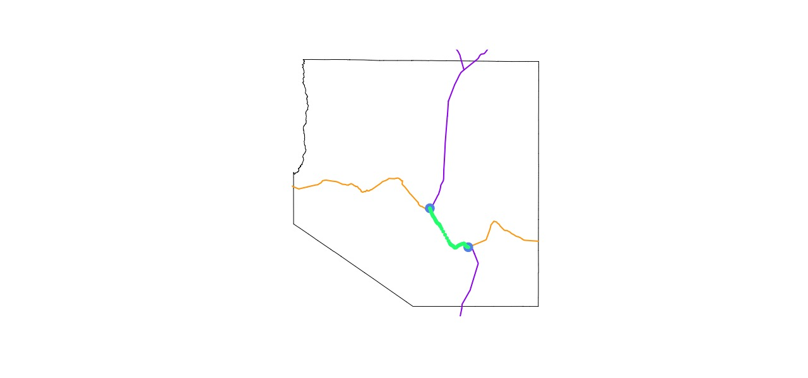

Biologist: "Hey, can you get me all the GNIS data from Lincoln and eastern White Pine County?"

Me: "Yup!"

30 minutes later, Biologist: "Didn't you hear me ask for *eastern* White Pine County? I only want data East of Highway 93."

Me: "...my bad. I'll get that to you shortly."

Also me: *How the heck am I going to do this without opening ArcMap?*

This is the story of how I spent several hours in R to avoid using an ESRI product. As you'll see, I can go to extreme measures to avoid ArcMap. I can't remember why I dislike ESRI so much. It's become my thing. Lucky for me, R is always there to solve every spatial problem I come across.

## Let's get going

Well, I better get to work. As always, I'll create a new folder and RStudio project to get started. Then setup my environment.

```r
library(sf)

counties <- read_sf('nv-counties.gpkg')
features <- read_sf('nv-features.gpkg')
nv_roads <- read_sf('nv-roads.gpkg')

# plot - see image below
plot(st_geometry(features), pch = 20, col = scales::alpha('purple', .4))
plot(st_geometry(counties), border = 'white', col = NA, lwd = 3, add = T)
```
<!-- TOOD: code to download and convert the data -->


*Note: unfortunately, the actual data that was requested is private. Instead, I'll use feature data from the [National Geographic Names Information System](https://www.usgs.gov/faqs/how-can-i-acquire-or-download-geographic-names-information-system-gnis-data?qt-news_science_products=0#qt-news_science_products) or GNIS. I dowloaded the data directly from [here](https://www.usgs.gov/core-science-systems/ngp/board-on-geographic-names/download-gnis-data). Data downloaded from the webiste is pipe delimited (`|`), make sure to use `delim = '|'` when loading any other data from this website into R.*

## Lincoln and White Pine County

I suppose I better properly document my first attempt at getting data for this biologist. That way I can remember how to do it next time.

The first thing first, isolate these two counties. I generally use base R for things like this. Since `{sf}` objects inherit from the tidyverse, `{dplyr}` is an option.

I try to stick a few naming conventions when working through analyses like this. I almost always use `aoi` when isolating an area of interest. Check the comments in the code for more detail if needed.

<!-- TODO: complete the extraction with  -->

```r
# base R
aoi <- counties[counties$CNTYNAME %in% c('White Pine', 'Lincoln'), ]

# dplyr
aoi <- dplyr::filter(counties, CNTYNAME %in% c('White Pine', 'Lincoln'))
```

## Eastern White Pine County

It shouldn't be too difficult to isolate Highway 93 and return the data east of that. Let's see:

1. Intersect the roads data with White Pine county to return the road network in this county.
2. Filter out all roads except Highway 93.
3. Intersect the the county polygon with the Highway 93 line.
4. Then use only the eastern most polgyon.

I should probably begin plotting some of these things to see how everything fits together.

```r
# subset roads network
wp_county <- aoi[aoi$CNTYNAME == 'White Pine', ]
roads_aoi <- nv_roads[aoi, ]
wp_roads <- roads_aoi[wp_county, ]

plot(st_geometry(wp_county))
plot(st_geometry(roads_aoi), col = 'purple', add = T)
```

I honestly can't remember where I got this road network data from. The `NAME` attribute of the roads data contains the highway number for each road. Use either base R or `{dplyr}` to filter the roads for 93.

```r
hwy_93 <- wp_roads[wp_roads$NAME == '93', ]

plot(st_geometry(wp_county))
plot(st_geometry(hwy_93), col = 'purple', add = T)
```


You gotta be kidding me! Highway 93 isn't a single line? What is this gap between the two sections?

I can think of three or four places where this happens here in Nevada. Highway 93 and Highway 50 run along the same stretch of road between two towns.

This is where things will get interesting. I know there is a tool in ArcMap that will let me create a new feature (geometry). It will even snap the points of the new geometry to an existing feature. That could come in handy.

NO! I will not open ArcMap! I will figure this out in R.

```r
hwy_50 <- wp_roads[wp_roads$NAME == '50', ]

plot(st_geometry(wp_county))
plot(st_geometry(hwy_93), col = 'purple', add = T)
plot(st_geometry(hwy_50), col = 'orange', add = T)
```


### Intersecting Hwy 50 & Hwy 93

I need to figure out how to extract just the portion of Highway 50 that is between the two sections of Highway 93. I know that `st_intersects` returns a [logical matrix](https://r-spatial.github.io/sf/reference/geos_binary_pred.html). I want the actual points of the intersection. What does `st_intersection` [do](https://r-spatial.github.io/sf/reference/geos_binary_ops.html)?

Also, I'm so grateful for tab completion in RStudio. I might have spent all day searching for a function called `st_intersection` otherwise.

```r
intersection <- st_intersection(
  st_geometry(hwy_93), 
  st_geometry(hwy_50)
)

# intersection
# Geometry set for 4 features 
# geometry type:  POINT
# dimension:      XY
# bbox:           xmin: -114.8726 ymin: 39.02536 xmax: -114.5811 ymax: 39.25418
# epsg (SRID):    4326
# proj4string:    +proj=longlat +datum=WGS84 +no_defs
# POINT (-114.8726 39.25418)
# POINT (-114.8726 39.25418)
# POINT (-114.5811 39.02536)
# POINT (-114.5811 39.02536)

intersection <- as.data.frame(st_coordinates(intersection)[c(1, 3), ])

plot(st_geometry(wp_county))
plot(st_geometry(hwy_93), col = 'purple', lwd = 2, add = T)
plot(st_geometry(hwy_50), col = 'orange', lwd = 2, add = T)
points(x = intersection$X, y = intersection$Y, 
       col = 'cornflowerblue', pch = 19, cex = 2, add = T)
```


I'm not sure why the result of the intersection has four points, two duplicate points. That is something I'll have to look into sometime. For now I'll convert the intersection to a `data.frame` then remove the duplicate points. 

Yeah, occasionally I need to hack my through a problem like this. I'm not ashamed of it.

A bit of a recap. The purple line is highway 93, the orange is highway 50, and the blue points are the points where the two intersect. 

### Extracting a segment

Now how do I extract that segment of highway 50 between the two portions of of highway 93? A bit more hacking.

Lines in `{sf}` are lists of coordinate pairs (same with `{sp}` for that matter). Can I deconstruct the lines into their coordinate pairs? Yes, of course, with `st_coordinates`, which returns a `matrix` of coordinate pairs. And a third column, what in the world is in that third column? A mystery for another time.

```r
hwy_50_coords <- as.data.frame(st_coordinates(hwy_50))

# extract the segment
hwy_50_segment <- hwy_50_coords[hwy_50_coords$X >= min(intersection$X) &
                                hwy_50_coords$X <= max(intersection$X), ]

# plot it
plot(st_geometry(wp_county))
plot(st_geometry(hwy_93), col = 'purple', lwd = 2, add = T)
plot(st_geometry(hwy_50), col = 'orange', lwd = 2, add = T)
points(x = intersection$X, y = intersection$Y, 
       col = 'cornflowerblue', pch = 19, cex = 2)
points(x = hwy_50_segment$X, y = hwy_50_segment$Y,
       col = 'springgreen', pch = 20)
```



Since a line is just a list of coordinate pairs, I should be able to do the opposite to recombine them back into a line.

```r
hwy_50_line <- st_linestring(x = as.matrix(hwy_50_segment[, 1:2]))
plot(hwy_50_line, lwd = 2, col = 'springgreen')

## that didn't work properly
hwy_50_line <- st_linestring(
  x = as.matrix(hwy_50_segment[order(hwy_50_segment$X), 1:2])
)
plot(hwy_50_line, lwd = 2, col = 'springgreen')
```

I can't believe that worked. I like to think I generally have more elegant solutions than this. If I'm being honest, most of my code is hacking together answers from one StackOverlow post, mixed with some code from GitHub Issues. 

Or I try thousands of different things until I figure it out. 

<!-- figgeritout bud gif from letterkenney? -->

For instance, why in the world are the points out of order in that first line (the first plot in the code snippet above)? I don't even know what bit of code caused that to happen. I do know that the highway 50 runs west to east. If I order the data along the X axis, the coordinates should be in the proper order.

### Merge into Highway 93

Now merge this little line segment of Highway 50 into Highway 93.

```r
hwy_93_merged <- st_union(hwy_50_line, st_geometry(hwy_93))
#> Error in geos_op2_geom("union", x, y) : 
#> st_crs(x) == st_crs(y) is not TRUE

st_crs(hwy_50_line)
#> Coordinate Reference System: NA

# add CRS, must have a geometry object
st_crs(hwy_50_geom) <- st_crs(4326)

hwy_93_merged <- st_union(hwy_50_geom, st_union(st_geometry(hwy_93)))

plot(st_geometry(wp_county))
plot(st_geometry(hwy_93_merged), lwd = 2, col = 'purple', add = T)
```


`{sf}` is a very noisy package. So many errors and warnings are reported to the console. It's becomes tiresome after awhile. 

After some trial and error they two lines are merged into a single feature. And now the boundary that divides White Pine county is defined. I can foresee some issues with the actualy shape of this geometry. That little fork at the northern end might cause a problem later.

## Define the aoi

Now I can get to work defining the area of interest. I was right about the `MULITLINE`, it is an issue when using `st_intersect` with polygons. The best way I can think of to get around this problem is to use `st_buffer` to turn the road into a polygon. Then `st_difference` to split the polygon of White Pine county into three separate polygons.

```r
wp_split <- st_difference(
  wp_county,
  st_buffer(hwy_93_merged, dist = .0001)
)
#> dist is assumed to be in decimal degrees (arc_degrees).
#> although coordinates are longitude/latitude, st_difference assumes that they are planar
#> Warning messages:
#> 1: In st_buffer.sfc(hwy_93_merged, dist = 1e-04) :
#>   st_buffer does not correctly buffer longitude/latitude data
#> 2: attribute variables are assumed to be spatially constant throughout all geometries

wp_split
#> Simple feature collection with 1 feature and 6 fields
#> geometry type:  MULTIPOLYGON
#> dimension:      XY
#> bbox:           xmin: 593967.3 ymin: 4282866 xmax: 756640.7 ymax: 4444917
#> epsg (SRID):    26911
#> proj4string:    +proj=utm +zone=11 +ellps=GRS80 +towgs84=0,0,0,0,0,0,0 +units=m +no_defs
#> A tibble: 1 x 7 ...

wp_split <- st_cast(wp_split, 'POLYGON')
wp_split$id <- 1:nrow(wp_split)
plot(wp_split['id'])
```


So many warnings!! But, with even more hacking, I have a polygon that defines easter White Pine county. It is really hard to tell, but there is a small gap between these polygons. Try running the code snippet and change the distance in the buffer function.

### Union the polygons

So close. I can sense the finish line. 

```r
aoi_union <- st_union(wp_split[wp_split$id == 3, ], 
                      counties[counties$CNTYNAME == 'Lincoln', ])
plot(st_geometry(aoi_union))

# let me just double check the crs one last time
st_crs(aoi_union)
```

## Filter the features

And finally, I have the aoi defined and can now filter the `features`. 

```r
features_aoi <- features[aoi_union, ]

plot(st_geometry(aoi_union))
plot(st_geometry(features_aoi), pch = 20, col = scales::alpha('purple', .1), add = T)
```


Yes! That's it!

## Wrap up

I knew I didn't need to use ArcMap for this. This isn't the most efficient way to get complete this task. Off the top of my head I can think of a few other methods to accomplish the same results. Much more efficient methods too.

For instance, the road dataset from the `{tigris}` R package has more complete road data. Selecting Highway 93 is more difficult, but the road is complete. I should have started this project by looking for better data. 

Another quick way to get Highway 93 is to use a service like [CalTopo](caltopo.com). There is a really cool feature on this website that allows you to draw lines on a map. As the lines are drawn they are snapped to a nearby feature. In this case, Highway 93. Then export the data as a GeoJSON and load it into R. 

Regarless, I'm happy that I used R to solve this problem. People are surprised when I tell them I do all my GIS work in R. I eventually concede that R is great for all GIS tasks except detailed cartography. And I will stick by this statement for a very long time. R's spatial abilities are only going to improve as packages like `{sf}` improve.

If you have any thoughts or improvements you can create an [issue on the repo for site](https://github.com/kissmygritts/kissmygritts).