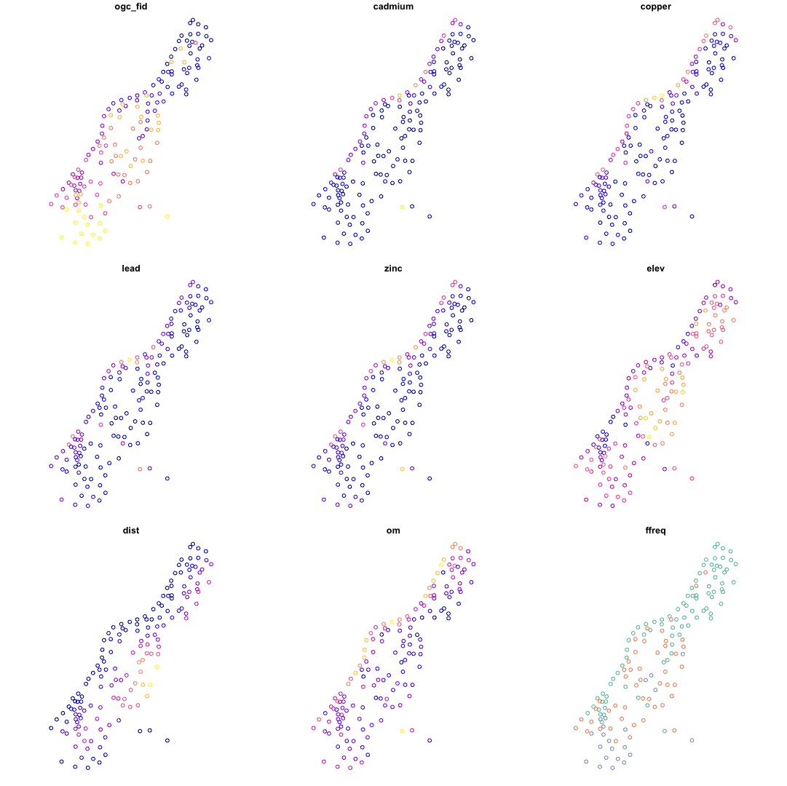

---
title: CS Weekly 4 - Comparing sf and sp
date: 2019-10-04
published: true
tags: ['cs friday', 'r', 'spatial']
canonical_url: false
description: 'Weekly computer science inspired tips for Instagram, #4'
--- 

[Simple features](https://en.wikipedia.org/wiki/Simple_Features) is an Open Geospatial Consortium (OGC) and International Organization for Standardization (ISO) standard that specifies storage and access models for spatial data. The R package `sf` [implements simple features in R](http://pebesma.staff.ifgi.de/RJwrapper.pdf), and is viewed as a replacement for the `sp` package. These packages share many similar methods, work nicely with base R, and share contributors. 

In this post I'll show some very simple differences between the packages.

## Data

We'll work with a slightly contrived example, but it is the easiest way to get started. First, install `sf`, `sp`, `RSQLite`.

```r
install.packages(c('sf', 'sp', 'RSQLite'))

library(sf)
library(sp)
library(RSQLite)

# get muese data
db <- system.file('sqlite/meuse.sqlite', package = 'sf')
dbcon <- dbConnect(dbDriver('SQLite'), db)
s <- st_read(dbcon, 'meuse.sqlite')

## create data frame of data
pts_data <- cbind(st_drop_geometry(s), st_coordinates(s))
```

This is a very contrived example. Normally we would read in a csv file with x and y coordinates. To save time, we will used a built in dataset, the meuse data. This is saved as a SQLite file, hence the need for `RSQLite`. 

## Create sp Objects

Creating a `sp` objects is relatively. Points are the easiest spatial data type to deal with. The code below will create a `SpatialPointsDataFrame`.

```r
pts_sp <- sp::SpatialPointsDataFrame(
  data = pts_data,
  coords = pts_data[, c('x', 'y')],
  proj4string = CRS('+init=epsg:28992')
)
```

Here is a rundown of the parameters for the function above.

* data: the `data.frame` to be turned into a sp object
* coords: a `matrix`, or data type that can be coerced to a matrix, of the x and y coordinates
* proj4string: a coordinate reference system, in this case, the [EPSG ID](http://epsg.io/28992) as a PROJ4 string.

### Structure

`sp` objects are S4 classes with many attributes. This can be checked with the `mode(pts_sp)` function call. In S4 classes, objects can be accessed with the `@` sign.

```r
str(pts_sp)
#> Formal class 'SpatialPointsDataFrame' [package "sp"] with 5 slots
#>   ..@ data       :'data.frame':	155 obs. of  15 variables:
#>   .. ..$ ogc_fid: int [1:155] 1 2 3 4 5 6 7 8 9 10 ...
#>   .. ..$ cadmium: num [1:155] 11.7 8.6 6.5 2.6 2.8 3 3.2 2.8 2.4 1.6 ...
#>   .. ..$ copper : num [1:155] 85 81 68 81 48 61 31 29 37 24 ...
#>   .. ..$ lead   : num [1:155] 299 277 199 116 117 137 132 150 133 80 ...
#>   .. ..$ zinc   : num [1:155] 1022 1141 640 257 269 ...
#>   .. ..$ elev   : num [1:155] 7.91 6.98 7.8 7.66 7.48 ...
#>   .. ..$ dist   : num [1:155] 0.00136 0.01222 0.10303 0.19009 0.27709 ...
#>   .. ..$ om     : num [1:155] 13.6 14 13 8 8.7 7.8 9.2 9.5 10.6 6.3 ...
#>   .. ..$ ffreq  : chr [1:155] "1" "1" "1" "1" ...
#>   .. ..$ soil   : chr [1:155] "1" "1" "1" "2" ...
#>   .. ..$ lime   : chr [1:155] "1" "1" "1" "0" ...
#>   .. ..$ landuse: chr [1:155] "Ah" "Ah" "Ah" "Ga" ...
#>   .. ..$ dist.m : num [1:155] 50 30 150 270 380 470 240 120 240 420 ...
#>   .. ..$ x      : num [1:155] 181072 181025 181165 181298 181307 ...
#>   .. ..$ y      : num [1:155] 333611 333558 333537 333484 333330 ...
#>   ..@ coords.nrs : num(0) 
#>   ..@ coords     : num [1:155, 1:2] 181072 181025 181165 181298 181307 ...
#>   .. ..- attr(*, "dimnames")=List of 2
#>   .. .. ..$ : chr [1:155] "1" "2" "3" "4" ...
#>   .. .. ..$ : chr [1:2] "x" "y"
#>   ..@ bbox       : num [1:2, 1:2] 178605 329714 181390 333611
#>   .. ..- attr(*, "dimnames")=List of 2
#>   .. .. ..$ : chr [1:2] "x" "y"
#>   .. .. ..$ : chr [1:2] "min" "max"
#>   ..@ proj4string:Formal class 'CRS' [package "sp"] with 1 slot
#>   .. .. ..@ projargs: chr "+init=epsg:28992"

mode(pts_sp)
#> [1] "S4"

## get proj4string attribute
pgs_sp@proj4string
#> CRS arguments: +init=epsg:28992
```

### Plotting

The `sp` package extends base plotting in R. This means that you can use `sp` objects in base R's `plot` function. All the same plotting paramaters can be used. I'm only showing how the base plotting works here. 

```r
plot(sp)
```


### Subsetting

Subsetting based on data in the data attribute is very easy, and similar to how base R subsetting works on `data.frames`. You can see the results of subsetting by looking at the underlying data attribute, or visualizing the resulting object.

```r
sub_pts_sp <- pts_sp[pts_sp$lead < 50, ]
plot(sub_pts_sp)

## the View() function opens a nice spreadsheet like view of the data in RStudio
View(sub_pts_sp)
```

## Creating sf Objects

This is very similar to sp.

```r
pts_sf <- sf::st_as_sf(
  x = pts_data,
  coords = c('x', 'y'),
  crs = 28992
)
```

And the rundown of the parameters for the function above

* x: the `data.frame` to be turned into an sf object
* coords: the name of the columns in the data.frame of x to be used as the coordinates
* crs: the coordinate reference system

### Structure

`sf` objects extend base R `data.frames`. The are their own class, but really, a list with some additional attributes. It looks a lot like a `data.frame`. The spatial data is stored in the a field called geometry. The geometry contains all the spatial information for the object.

```r
str(pts_sf)
#> Classes ‘sf’ and 'data.frame':	155 obs. of  14 variables:
#>  $ ogc_fid : int  1 2 3 4 5 6 7 8 9 10 ...
#>  $ cadmium : num  11.7 8.6 6.5 2.6 2.8 3 3.2 2.8 2.4 1.6 ...
#>  $ copper  : num  85 81 68 81 48 61 31 29 37 24 ...
#>  $ lead    : num  299 277 199 116 117 137 132 150 133 80 ...
#>  $ zinc    : num  1022 1141 640 257 269 ...
#>  $ elev    : num  7.91 6.98 7.8 7.66 7.48 ...
#>  $ dist    : num  0.00136 0.01222 0.10303 0.19009 0.27709 ...
#>  $ om      : num  13.6 14 13 8 8.7 7.8 9.2 9.5 10.6 6.3 ...
#>  $ ffreq   : chr  "1" "1" "1" "1" ...
#>  $ soil    : chr  "1" "1" "1" "2" ...
#>  $ lime    : chr  "1" "1" "1" "0" ...
#>  $ landuse : chr  "Ah" "Ah" "Ah" "Ga" ...
#>  $ dist.m  : num  50 30 150 270 380 470 240 120 240 420 ...
#>  $ geometry:sfc_POINT of length 155; first list element:  'XY' num  181072 333611
#>  - attr(*, "sf_column")= chr "geometry"
#>  - attr(*, "agr")= Factor w/ 3 levels "constant","aggregate",..: NA NA NA NA NA NA NA NA NA NA ...
#>   ..- attr(*, "names")= chr  "ogc_fid" "cadmium" "copper" "lead" ...

mode(pts_sf)
#> [1] "list"
```

### Plotting

Plotting in `sf` is very similar to `sp`. Just like `sp`, `sf` objects use the base R plotting function. However, it behaves a little differently. The default behavior of plotting `sf` objects is to plot every column of data, colored by values. This can be very handy, but can be time consuming. There are two different ways to plot just the geometry. I'll show them below. 

```r
plot(pts_sf)

## plot just geometry
plot(pts_sf[0])

## an alternative
plot(st_geometry(pts_sf))
```



### Subsetting

Subsetting, again, works similarly to base R. 

```r
sub_pts_sf <- pts_sf[pts_sf$lead < 50, ]

## plot to see, remember to add the 0 to plot just the geometry
plot(sub_pts_sf[0])
```

`sf` objects can be subset with functions from the tidyverse. So the `dplyr` functions work here.

```r
View(dplyr::filter(pts_sf, lead < 50))
```

## Summary

I think it is safe to view `sf` as a complete replacement of `sp`. I have been using it for a year now, and find it much simpler to work with. There are a few pain points. For instance, when working with raster objects it is necessary to convert `sf` to `sp` objects. but this can be done within a funciton call, such as: `raster::extract(raster_dat, as(sf_obj, 'Spatial))`. Yes, a little more typing, but an easy solution.