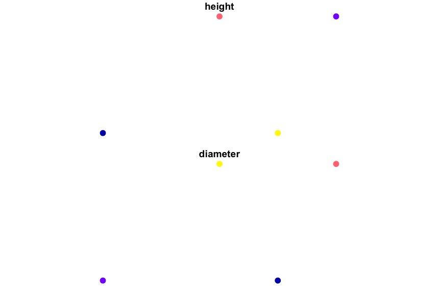

---
title: CS Weekly 5 - Simple Features in R
date: 2019-10-08
published: true
tags: ['cs friday', 'r', 'spatial']
canonical_url: false
description: 'Weekly computer science inspired tips for Instagram, #5'
--- 

Last week I compared some of the differences between `sf` and `sp`. In this post, I'll focus on the basics of `sf` and the basic data and geometry types provided by `sf`.

Simple features referes to a formal standard ([ISO 19125-1:2004](https://www.opengeospatial.org/standards/sfa)) that describes how geographic objects in the real world can be represented in computers. The standard is widely implemented in many spatial and GIS software (ESRI, PostGIS). 

For years, the standard spatial library in R was `sp`. It supported many of the spatial data types required for spatial analysis. However, it was created before the creation of the simple features standard. The `sf` library attempts to reconcile spatial data analysis in R with the simple feature standard. The long term goal is for `sf` to succeed `sp`. 

## Simple features

A feature is a thing located some where on Earth. This thing can be a tree, a stream, a road, a lake, an island, etc. Features can be 1 thing, like a tree, or many things, like all the islands of Hawaii. So a set of features can form a single object, like all the trees in a forest.

Lets provide a simple example, all the states in the United States. There are 50 states, if we were to put these states into a `data.frame` it would have 50 rows, each row is a state. Most states are a single polygon. For instance, Colorado only has a single shape (or geometry) associated with it. Hawaii on the other hand has several shapes associated with it, one for each island.

These shapes associated with each state are called geometries. Every other piece of data, population, area, etc., are called attributes. Together, the geometry and attributes create a spatial data set.

## Geometries

All geometries are composed of points. In the simplest case, coordinates in 2 dimensions (3 and 4 dimensions are possible) specifying the X and Y location of the point. Below are the 7 most common simple feature geometries.

* `POINT` - geometry containing a single point, zero-dimension
* `LINESTRING` - a sequence of points connected by a straight line segments, one-dimension
* `POLYGON` - a sequence of points that form a closed shape, two-dimension
* `MULTIPOINT` - a set of points
* `MULTILINESTRING ` - a set of linestrings
* `MULTIPOLYGON` - a set of polygons
* `GEOMETRYCOLLECTION` - a set of geometries of any type

### Creating Geometries

The basic structure of a geometry is called a simple feature geometry, or `sfg` in R. Creating any of these primitive types if fairly easy. Almost all the functions from `sf` are prefixed with `st_`.

```r
library(sf)

# create sfg ----
## points ----
p1 <- st_point(c(0, 1))
p2 <- st_point(c(-1, 0))
p3 <- st_point(c(0.5, 0))
p4 <- st_point(c(1, 1))

## linestring ----
l1 <- st_linestring(matrix(c(-1, -1, -0.5, 1), ncol = 2))

## polygon ----
poly1 <- st_polygon(
  list(
    rbind(c(-1, -1), c(1, -1), c(1, 1), c(-1, -1))
  )
)

## plot these
plot(poly1, col = 'gray', border = 'blue')
plot(l1, col = 'green', lwd = 5, add = T)
plot(p1, col = 'orange', pch = 19, cex = 2, add = T)
plot(p2, col = 'purple', pch = 17, cex = 2, add = T)
plot(p3, col = 'red', pch = 15, cex = 2, add = T)
plot(p4, col = 'brown', pch = 3, cex = 2, lwd = 5, add = T)
```

Here we created simple geometries. The resulting plot should look like the following image. 


All of the base R plotting functionality is available when plotting `sf` objects. 

Creating any of the `MULTI*` requires matrices, or lists of matrices for each elements in the feature set. For `MULTIPOINT` the data needs to be a matrix where each row is a point. For `MULTILINESTRING` or `MULTIPOLYGON` the data needs to be a list of matrices, each row in a matrix is point, for each geometry in the set. Check the [documentation](https://r-spatial.github.io/sf/reference/st.html) for more information about these geometry types. While these are common, I won't cover them here.

### Sets of geometries

In the section above geometries were handled individually. It is typical to work with them as sets. `sf` calls these sets of geometries simple feature geometry column, `sfc`. To create one, combine individual geometries and a coordinate reference system. 

```r
sf_sfc <- st_sfc(p1, p2, p3, p4, crs = 4326)
sf_sfc

#> Geometry set for 4 features 
#> geometry type:  POINT
#> dimension:      XY
#> bbox:           xmin: -1 ymin: 0 xmax: 1 ymax: 1
#> epsg (SRID):    4326
#> proj4string:    +proj=longlat +datum=WGS84 +no_defs
#> POINT (0 1)
#> POINT (-1 0)
#> POINT (0.5 0)
#> POINT (1 1)

class(sf_sfc)
#> [1] "sfc_POINT" "sfc"

names(attributes(sf_sfc))
#> [1] "class"     "precision" "bbox"      "crs"       "n_empty"
```

The code block above created an `sfc` from the points in the first example. The printing the object shows it's contents, as well as several spatial attributes associated with it. Check the class and the names of the metadata of the `sfc`. We can plot this object, and like above, all the functionality of the plot function is available.

Thinking back to the US states example, all the states will comprise the `sfc`. Each state, a `sfg`, will be a row in the `sfc`. The geometry type for the `sfg` will be `MULTIPOLYGON` because some states can't be drawn as a single polygon (Michigan and Hawaii).

It is possible to combine different geometries into a single `sfc`. In these cases the geometry type is set to `GEOMETRY`.

### Geometries and attributes

What about attribute data associated with each point. Think back to the forest example. Each tree is a point, which is stored as an simple feature geometry, `sfg`. The set of trees in the forest are combined into a simple feature geometry column, `sfc`. To combine attribute data, such as height and diameter, to the `sfc` we can use an `sf` object. 

`sf` objects are `tibbles` or `data.frames`. If you are familiar with the tidyverse, think of them as `tibbles`, if not, think of them as `data.frames`. Creating these `sf` objects from tables with x and y coordinates are simple, use the `st_as_sf` function. However, let's extend the example we've been building up this entire article.

```r
# create attribute data for the trees: height and diameter of the trunk
ht <- rnorm(4, 75, 10)
diam <- rnorm(4, 2.5, 1)

# create sf object, a tibble like structure with these data
tree_sf <- sf::st_sf(
  ## list of data, columns to bind together, one must be a geometry
  list(height = ht,
       diameter = diam,
       sf_sfc),
  crs = 4326)

tree_sf
#> Simple feature collection with 4 features and 2 fields
#> geometry type:  POINT
#> dimension:      XY
#> bbox:           xmin: -1 ymin: 0 xmax: 1 ymax: 1
#> epsg (SRID):    4326
#> proj4string:    +proj=longlat +datum=WGS84 +no_defs
#>     height diameter           NA.
#> 1 75.06560 3.800921   POINT (0 1)
#> 2 66.62554 2.692367  POINT (-1 0)
#> 3 86.64016 1.536680 POINT (0.5 0)
#> 4 73.31864 3.474714   POINT (1 1)

plot(tree_sf, pch = 19, cex = 1.5)
```

The function `st_sf` first parameter is `...`. This should be a list of columns (equal length vectors to be coerced into a `data.frame`), one of which is a geometry column. Always add a CRS! Without a CRS we won't know where on earth the data are located. 

The plot function works a little differently here. Instead of plotting just the points, it takes each attributes, scales the color based on the data for the attribute, and plots each attribute as a separate plot. Pretty neat default behavior.



## Moving to `sf`

The `sf` library is maturing quickly. More and more packages are playing nicely, and when they don't, converting `sf` to `sp` objects is simple: `as(sf, 'Spatial')` (replace sf with your sf object). This function will take your `sf` object and converted to the proper `sp` object. 

Below are two of the best resources I've encountered for spatial data analysis in R. Both use `sf`, and are free online!

[Geocomputation with R](https://geocompr.robinlovelace.net/) - My introduction to `sf` came from this book. 

[Spatial Data Science](https://keen-swartz-3146c4.netlify.com/index.html) - Written by Edzer Pebesma and Roger Bivand, two of the maintainers of `sf` and `sp`. A work in progress.

Finally, the [website](https://r-spatial.github.io/sf/index.html) for `sf` is a great resource with many vignettes.