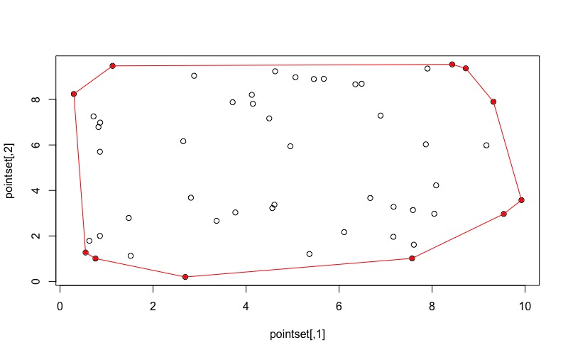

I think that it is important to start at first principles in this series. Where better than Minimum Convex Polygons (MCP)! Perhaps one of the first analytical methods for delineating a species home range, the has fallen out of favor over the last several years. The main strength of an MCP is its simplicity. An MCP can be built using observations, trap locations, fecal or hair snare locations, radio telemetry, or GPS telemetry locations. MCPs are easy to reason about as well (more on that below). However, they tend to over estimate the area of use, or core species areas. 

## The Convex Hull

The idea of a Minimum Convex Polygon is borrowed directly from mathemateics ([convex hull](https://en.wikipedia.org/wiki/Convex_hull)). I will often use the term convex hull and convex polygon to interchangeably. They both mean the same thing: a set of points that is the smallest convex set that contains all the points. That sounds confusing. To help visualize a convex hull, imagine a board with a set of nails on it. Now stretch a rubber band around all the outermost nails. The shape made by the rubber band is the convex hull. The rubber band might not touch all of the nails. 

I distinguish convex and concave by remembering that convex is curved outward, while concave curves inwards (like a cave). In order to ensure that a convex hull is indeed convex, draw line segments that join each pair of points. If any of those lines cross over the boundary of the convex hull (or rubber band in the example above), then it isn't a convex hull. 

On a 2D plane the convex hull is a polygon. In 3 dimensions it is a 3 dimensional shape (cuboid, spherical) that has a volumn. A convex hull can be generalized into higher dimensions. A convex hull is not limited to points, and can be created for any type of geometric object. For instance, a set of lines can have a MCP that contains the entire set of lines. Same for a set of polygons.

Computing a minimum convex hull is a fundemental problem in computation geometry. I'm sure that you can think up a bit of pseudocode to compute the convex hull of a set of points. Just like the rubber band example above, identify the outermost points and draw a line connecting them. But, that is the hard part, and one of my favorite things to think about. It is easy for our eyes to identify the minimum convex hull, however, trying to get a computer to do it can be a bit of a challenge. 

Fortunately, there are [many algorithms](https://en.wikipedia.org/wiki/Convex_hull_algorithms) to compute the convex hull for a set of points or geometric objects. In R, there is a function (within the `grDevices` namespace, loaded at startup) `chull` that computes a convex hull. This is an implementation of the [Quickhull](https://en.wikipedia.org/wiki/Quickhull) algorithm. The documentation for `chull` references these two papers ([1](https://dl.acm.org/citation.cfm?doid=355759.355766), [2](https://dl.acm.org/citation.cfm?doid=355759.355768)). Honestly, the literature for this topic is fascinating, I highly recommend reading some of these papers. The [wikipedia](https://en.wikipedia.org/wiki/Quickhull) page for the algorithm gives a very good pseudo-code definition of the steps of the algorithm: 

1. Find the minimum and maximum x coordinates, these will always be part of the convex hull.
2. Use the line formed by the two points to divide the set in two subsets of points, which will be processed recursively.
3. Determine the point, on one side of the line, with the maximum distance from the line. The two points from step 1, and this point form a triangle.
4. The points lying inside of that triangle cannot be part of the convex hull, and can be ignored.
5. Repeat the previous two steps on the two lines formed by the triangle (not the initial line).
6. Keep on doing so until no more points are left, the points selected constitute the convex hull.

The `chull` function in R only works for 2 dimension. In the `geometry` package the function `convhulln` is generalized to *n*-dimensional space. Regardless of which hull computation function we use, both interface with an implementation written in C. As such, they are both very fast. If you need to work in *n*-dimensional space you'll need to resort to `geometry::convhulln`. The [`adehabitatHR` package](https://github.com/cran/adehabitatHR/blob/master/R/mcp.r) (a popular package for generating home ranges) uses `chull` for computing MCPs.

### Computing an Convex Hull

Let's generate a set of random points to work with. Then use the `chull` function to generate the convex hull of that point set.

``` r
# create a matrix of random points
pointset <- cbind(
  rnorm(100, mean = 0, sd = 10),
  rnorm(100, mean = 0, sd = 10)
)

# get index of convex hull points. 
# the chull function returns the index of the points that
# define the convex hull, not the actual points
hull_idx <- chull(pointset)

# get the actual points of the convex hull
hull_pts <- pointset[hull_idx, ]

# plot the results
plot(pointset)
points(hull_pts, col = 'red', pch = 20)

# note, that the hull_pts aren't a closed polygon
plot(hull_pts)
lines(hull_pts)

# to create a closed polygon, the first point must also be the last point
hull <- pointset[c(hull_idx, hull_idx[1]), ]
```

There we have it, the vertices of the convex hull this pointset. 



## Minimum Convex Polygons

In ecology most MCP methods allow for computing a *n* percentile MCP in order to reduce the influence of outliers. I often see the 90%, 95%, or 99% MCP estimated. This doesn't change how the convex hull is estimated. What does change is the points that are used for the convex hull estimation.

When computing a *n* percentile MCP we are asking for the *n*% of points closest to the centroid of the pointset. So these are the steps in computing an *n* percentile MCP:

1. Compute the centroid of the pointset.
2. Calculate the distance between every point and the centroid.
3. Exclude points greater than *n* percentile away from the centroid.
4. Compute the convex hull for the remaining points.

The code below walks through the computation for generating an *n*% MCP.

``` r
# use the same data as above
centroid <- apply(pointset, 2, mean)

# compute the distance from the centroid
d <- sqrt(((pointset[, 1] - centroid[1])^2) + ((pointset[, 2] - centroid[2])^2)) 

# get the points where the distance to the 
# centroid <= the selected percentile
# since our original pointset is 100 points, and we selected
# the 95 percentile, there should be 95 points in new_pointset
new_pointset <- pointset[seq_along(d)[d <= quantile(d, .95)], ]

# compute the convex hull of this new_pointset
hull95 <- chull(new_pointset)

# remember, chull returns the index of each point
# and the first point and last point must be the same
hull95 <- new_pointset[c(hull95, hull95[1]), ]

# and we can plot the MCP
plot(pointset, asp = 1)
lines(hull95, col = 'red')
points(centroid[1], centroid[2], col = 'blue', pch = 20)
```


The MCP above should have 5 points not within the border (since we calculated a 95% MCP of 100 points).

Of course, all this can be wrapped up into a function. Try the function below on the original pointset. You should get the same MCP as the image above.

``` r
get_mcp <- function(x, pct) {
  # x is a matrix of coordinates,
  # pct is the percentile MCP to calculate
  centroid <- apply(x, 2, mean)
  d <- sqrt(((x[, 1] - centroid[1])^2) + ((x[, 2] - centroid[2])^2))

  # create pct pointset
  pointset <- x[seq_along(d)[d <= quantile(d, pct)], ]
  
  # get vertices of the convex hull
  vertices <- chull(pointset)

  # return a matrix of xy-coordinate pairs that define the mcp
  return(pointset[c(vertices, vertices[1]), ])
}
```

## MCP Properties

The result of `get_mcp` is a polygon. Assuming we are tracking animals via GPS, or observations that polygon has a meaningful spatial context. We are likely interested in some of the properties of that polygon. In previous iterations of this `get_mcp` function I've converted the polygon to one of the `sp` classes to calculate the perimeter and area of the polygon. I've since found formulas to calculate these two properties on any irregular polygon shape.

``` r
area <- function (mat) {
  x <- mat[, 1]
  y <- mat[, 2]
  n_vert <- length(x)

  x1 <- x[2:n_vert]
  y1 <- y[2:n_vert]
  x2 <- x[1:n_vert - 1]
  y2 <- y[1:n_vert - 1]

  sum(x1 * y2 - y1 * x2) / 2
}

perimeter <- function (mat) {
  x <- mat[, 1]
  y <- mat[, 2]
  n_vert <- length(x)
  
  x1 <- x[2:n_vert]
  y1 <- y[2:n_vert]
  x2 <- x[1:n_vert - 1]
  y2 <- y[1:n_vert - 1]
  
  sum(sqrt((x1 - x2)^2 + (y1 - y2)^2))
}
```

The value returned by these functions will have a unit based on the units of the input data.

## Wrap Up

I'm one of those people that really likes to peak inside the black box. A part of me really needs to understand the underlying processes for many of the functions and methods I use. Sure, it is easy to just use a function, and I do that sometimes, but without looking inside, I have very little confidence in the results. 

MCPs are very simple. And many of the drawback to using them are legitimate. I generally recommend MCPs if the data is sparse, or comes from trapping grids, etc. I've also heard that MCPs can be used to define the available area in resource selection functions. I don't know that I would do that, but decent suggestion if you can justify it. I would reserve MCPs for very rudimentary data exploration or if you can justify their use.

There are several fields where MCPs are useful. For instance, in self driving cars. The shape of a car can be defined as its MCP. If the MCP isn't going to run into anything, then the car wont either. It would be computationally intensive to encode the true shape of the car. The MCP is a good heuristic for self driving cars.

Extensions to the MCP can been developed. I often use local or daily MCPs to get an idea of an animals movement throughout a single time peroid, then do this over the entire trajectory of an animal. Because of their simplicity, I can do this quickly for animals with many points and many animals. More on that in a future post.

If you have any questions or suggestions you can [leave them here](https://github.com/kissmygritts/mgritts.com/issues/2).
