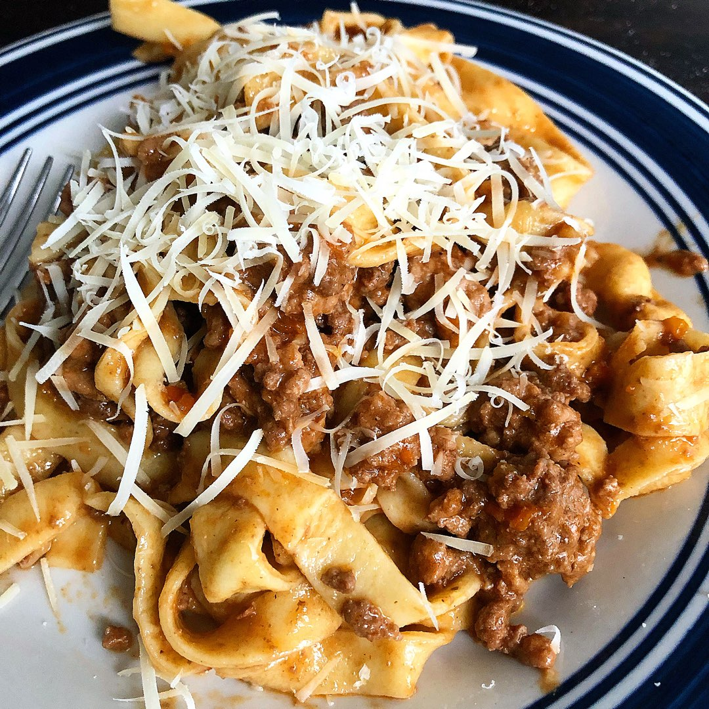

Took a week off, sick(?). Back up and running.

## Notes fro mthe week

### gql-gus

Tests, tests. Still trying to figure out the benefits of object composition for the repos.

### TWS abstract

Telemetry data app. Similar to the terrain statistics view in CalTopo

## R-Bootcamp

I was able to lead the spatial module again. It had been a while.

## Reading

### Simple, correct, fast: in that order
Drew DeVault [link](https://drewdevault.com/2018/07/09/Simple-correct-fast.html)

### Oh shit, my weekend project turned into an App Store Best New App
Tanner Christensen [link](https://tannerchristensen.com/blog/2018/12/30/oh-shit-my-weekend-project-turned-into-an-app-store-best-new-app)

Came across this on hacker news. Scratch your own itch. 

## Cook

This weekend a friend and I cooked pasta and ragu from scratch. The recipe from the ragu came from [Salt, Fat, Acid, Heat](https://www.saltfatacidheat.com/buy-book). It turned out great. A few things I need to do better for next time: 

* better mince the veggies
* cook to sofritto for a little bit longer
* less wine - I'm not a fan of that flavor
* less cinnamon
* more tomato paste

The pasta was great!

